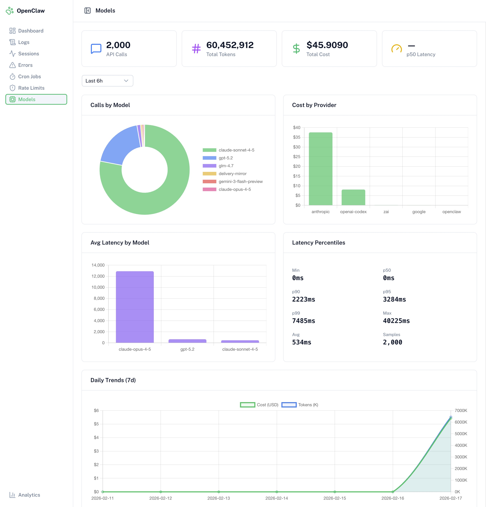

# OpenClaw Logging System

Real-time agent logging and monitoring dashboard for OpenClaw. Built with Nuxt 4 and Convex.



## Features

- **Log Viewer** -- Real-time log stream with level filtering and full-text search
- **Session Browser** -- Aggregated session summaries with token usage, cost, and tool call stats
- **Error Dashboard** -- Dedicated error tracking with resolution state management
- **Analytics** -- Charts for log volume, error rates, and session trends over time
- **Model Usage** -- Per-model and per-provider token/cost/latency analytics
- **Cron Monitoring** -- Track cron job executions with duration and status
- **Rate Limit Tracking** -- Monitor API rate limit events with retry-after info
- **Self-Documenting API** -- Agents can query `apiDocs.describe` to discover the full API schema at runtime

## Tech Stack

- **Framework**: [Nuxt 4](https://nuxt.com) (Vue 3 Composition API)
- **Backend**: [Convex](https://convex.dev) (real-time database + TypeScript functions)
- **UI**: [@nuxt/ui v4](https://ui.nuxt.com) (Reka UI + Tailwind CSS v4)
- **Charts**: [Chart.js](https://www.chartjs.org) via vue-chartjs
- **Testing**: [Vitest](https://vitest.dev) + @vue/test-utils + happy-dom
- **Package Manager**: pnpm

## Quick Start

```bash
git clone https://github.com/jake-101/openclaw-logging-system-nuxt-convex.git
cd openclaw-logging-system-nuxt-convex
pnpm install
cp .env.example .env
# Edit .env with your Convex URLs (see setup guide)
```

For the full end-to-end setup (Convex deployment, auth, sync scripts), see the **[Setup Guide](docs/setup-guide.md)**.

### Prerequisites

- Node.js 20+
- pnpm 10+
- A Convex deployment ([self-hosted](https://github.com/get-convex/convex-backend) or [cloud](https://dashboard.convex.dev))

## Documentation

| Doc | Description |
|-----|-------------|
| **[Setup Guide](docs/setup-guide.md)** | End-to-end setup from Convex deployment to first sync |
| **[Agent Integration](docs/agent-integration.md)** | TypeScript/JS `ConvexLogger` wrapper for direct logging |
| **[Agent Scripts](agent-scripts/README.md)** | Python sync scripts for OpenClaw session data |

## Scripts

| Command | Description |
|---------|-------------|
| `pnpm dev` | Start Nuxt dev server with HMR |
| `pnpm build` | Production build |
| `pnpm preview` | Preview production build locally |
| `pnpm lint` | ESLint check |
| `pnpm lint:fix` | ESLint with auto-fix |
| `pnpm typecheck` | TypeScript type checking |
| `pnpm test` | Run all tests |
| `pnpm test:watch` | Run tests in watch mode |
| `pnpm convex:dev` | Start Convex dev server |
| `pnpm convex:deploy` | Deploy Convex functions to production |

## Project Structure

```
app/                      # Nuxt 4 frontend
  components/             # Auto-imported Vue components
  composables/            # Shared composables (charts, navigation)
  pages/                  # File-based routing
  plugins/                # Chart.js registration, Convex client
  utils/                  # Formatting helpers, color constants
convex/                   # Convex backend
  schema.ts               # Database schema
  logs.ts                 # Log CRUD
  sessions.ts             # Session management
  errors.ts               # Error tracking
  cronRuns.ts             # Cron job tracking
  rateLimits.ts           # Rate limit events
  modelUsage.ts           # Model API call tracking
  apiDocs.ts              # Self-documenting API endpoint
agent-scripts/            # Python sync scripts for OpenClaw
docs/                     # Setup and integration guides
```

## Database Schema

Six core tables: `logs`, `sessions`, `errors`, `cronRuns`, `rateLimits`, `modelUsage`. Plus two aggregation tables: `logCounters`, `dailyStats`.

All timestamps are Unix milliseconds. Session keys (format: `{agentId}-{date}-{shortId}`) link logs to sessions.

For the full schema, see [`convex/schema.ts`](convex/schema.ts) or query the `apiDocs.describe` endpoint at runtime.

## License

[MIT](LICENSE)
